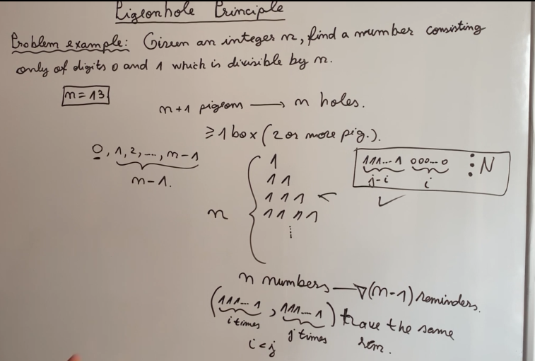

# coding-interview-preparation
This repository is for code and notes of data structures and algorithms practiced for coding interviews

## Prime Number Test
Definition - A number that is divisible by 1 and itself. 

Brute Force Approach: Time Complexity O(n)

```
for i in range [2, (n-1)]:
    if n % i == 0:
    return false

return true
```

Second definition: A number is not prime if it can be written as product of 2 natural numbers greater than 1 and less than the number itself

Let `n` be the number to be checked

1. n = a.b, a is in [2, n-1]
2. We assume that `a` is smaller i.e `a<=b` and therefore `b` can be represented as `n/a`
3. Therefore, `a.b >= a**2` --> `n >= a**2` --> `a <= sqrt(n)`

Smart approach: Time Complexity O(sqrt(n))

```
for i in range [2, sqrt(n)]:
    if n % i == 0:
    return false

return true
```
## Prime Factorization

Definition: Prime factorization is dividing a number by prime number multiple times to return 1

Basic Approach: Time Complexity O(n)
```
global f = [], expo = [], len
function primeFact(n):
    d = 2
    while n > 1:
        k = 0
        while n % d == 0:
            n = n/d
            k++
        if k > 0:
            len++
            f[len] = d
            expo[len] = k
        d++
    
```
Smart Approach: Time Complexity O(sqrt(n))

```
global f = [], expo = [], len
function primeFact(n):
    d = 2
    while n > 1 && d*d <=n:
        k = 0
        while n % d == 0:
            n = n/d
            k++ 
        if k > 0:
            len++
            f[len] = d
            expo[len] = k
        d++

    if n > 1:
    len++
    f[len] = n
    
```
## Sieve of Eratosthenes
It is an algorithm to find all prime numbers up to to the given number.

The algorithm is as follows:
1. It starts with an array considering all elements as prime - marking them `True`
2. Starts with the number 2 and check if it is prime or not, if it is prime then all the multiples of that number are marked not prime or `False`

Pseudo code: 
```
global: bool isPrime[Nmax];
func sieveofEratosthenes(int Limit):
    for(int i = 2, i <=limit, i++):
        isPrime[i] = True
    for(int i = 2, i <=limit/2, i++):
        if(isPrime[i]):
            for(j = i * 2, j <=limit, j += i):
                isPrime[j] = False  
```
Time Complexity - O(limit * log(limit))

## Fast Modular exponentiation 

Brute Force - O(n)
```
int ans = 1
for(int i = 1, i<=n, i++):
    ans = (1LL * ans * a)%MOD
```

Special approach - O(log(n))

We know that `a**n` is `(a**(n/2)**2)` or `a*a**(n-1)` therefore we divide it and solve using divide and conquer method 

## Pigeonhole Principle

Problem - Given an integer n, find a number consisting only of digits 0 and 1 which is divisible by n 

Time Complexity - O(n)

Statement - if there are `n+1` pigeons and `n` holes then there is at least one hole with 2 pigeons

In our problem, `n` is pigeons and `remainder` are holes




